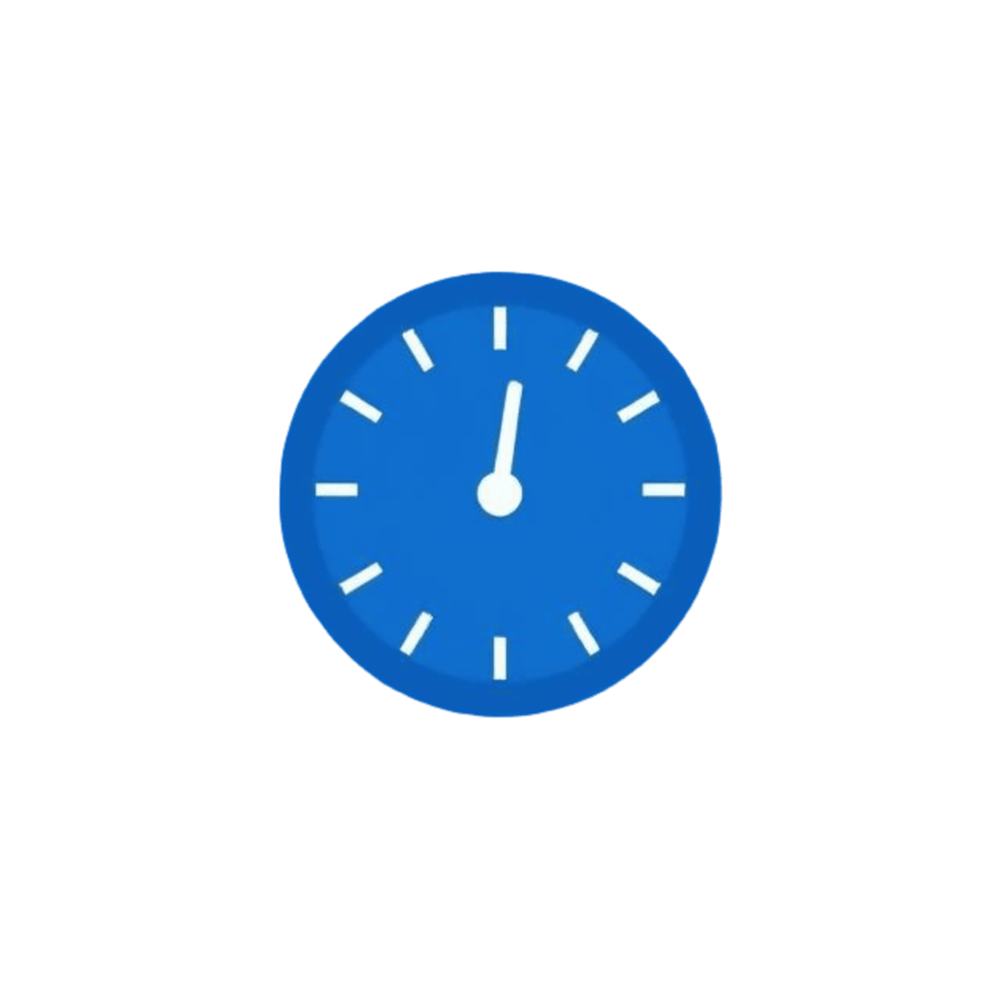

  
  
<h1>CodeClock</h1>Your Coding Time Tracker⚡

A Chrome extension that helps you to track and analyze your problem-solving speed across major coding platforms. Perfect for interview preparation and skill improvement.

## Features

- 🕒 Real-time coding timer
- 📊 Performance analytics
- 🔄 Draggable timer
- 💾 Historical data tracking
- 📈 Detailed time analysis with charts

## How to use?
1. Install CodeClock extension
2. Visit any problem (e.g.,`Two sum` problem on leetcode)
3. Click the CodeClock extension icon while on a coding problem
4. Select the difficulty level on the popup window.
5. Start coding while the timer tracks your time
6. Click stop when finished
7. View your performance analytics in the dashboard

## Supported Platforms

- LeetCode
- CodeChef
- CodeForces
- AtCoder
- HackerEarth
- HackerRank
- GeeksforGeeks

## Tech Stack

- React.js
- Chrome Extension APIs
- Chart.js for analytics
- Material-UI components
- Local Storage for data persistence

## Installation

1. Clone this repository
2. Run `npm install`
3. Run `npm run build`
4. Load the extension in Chrome:
   - Open chrome://extensions/
   - Enable Developer Mode
   - Click "Load unpacked"
   - Select the `build` folder

## Core Features

- Precise problem-solving analytics
- Platform-specific tracking
- Performance insights by difficulty

## Analytics Dashboard

Monitor your progress with:

- Completion trends
- Performance metrics
- Platform statistics
- Difficulty distribution

---