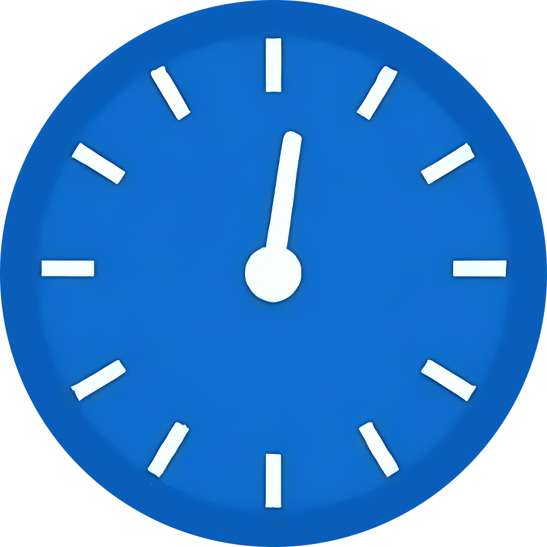

  
  
<h1>CodeClock</h1>Your Coding Time Tracker⚡

A Chrome extension that helps you to track and analyze your problem-solving speed across major coding platforms. Perfect for interview preparation and skill improvement.

## Features

- 🕒 Real-time coding timer
- 📊 Performance analytics
- 📈 Difficulty Specific analysis.
- 📈 platform Specific analysis
- 🔄 Draggable timer
- 💾 Historical data tracking

<h2>Watch the demo to learn how to set up and use</h2>

<video src="Guide/CodeClock-Guide.mp4" controls alt="CodeClock-Guide">

## How to Use?

1. **Download the CodeClock Extension**:  
   - [Click here to download](https://github.com/saidinesh49/CodeClock/releases/download/v1.0.1/build.zip).  
   - Extract the downloaded `.zip` file to get the `build` folder.

2. **Enable Developer Mode**:  
   - Open Chrome.  
   - Go to **Menu** > **Extensions** > **Manage Extensions**.  
   - Toggle on **Developer Mode** (you’ll see the option at the top-right corner).  

3. **Load the Extension**:  
   - Click **Load unpacked**.  
   - Select the extracted `build` folder.  

4. **Pin CodeClock for Easy Access**:  
   - Click the puzzle icon (Extensions) in the top-right corner of the browser.  
   - Find CodeClock and click the pin icon.  

5. **Start Using it⚡**:  
   - Visit any coding problem (e.g., the `Two Sum` problem on LeetCode).  
   - Click the **CodeClock** extension icon in the toolbar.  
> [!IMPORTANT]
> <code>➜ when using first time or If you’re visiting a platform where you haven’t used CodeClock before, refresh the page twice to ensure it works smoothly</code>

6. **Select Difficulty**:  
   - In the popup window, choose the difficulty level of the problem (`Easy`, `Medium`, or `Hard`).  

7. **Now, go ahead and code**:  
   - Begin coding while CodeClock tracks your progress.  

8. **Stop the Timer**:  
   - When you’re done, click **Stop** in the CodeClock popup.  

9. **Analyze Your Performance**:  
   - Open the **dashboard** to view detailed analytics, including your speed, trends, and insights.  

    
    

## Supported Platforms

- LeetCode
- CodeChef
- CodeForces
- AtCoder
- HackerEarth
- HackerRank
- GeeksforGeeks

## Tech Stack

- React.js
- Chrome Extension APIs
- Chart.js for analytics
- Material-UI components
- Local Storage for data persistence

## Core Features

- Precise problem-solving analytics
- Platform-specific tracking
- Performance insights by difficulty

## Analytics Dashboard

Monitor your progress with:

- Completion trends
- Performance metrics
- Platform statistics
- Difficulty distribution

---